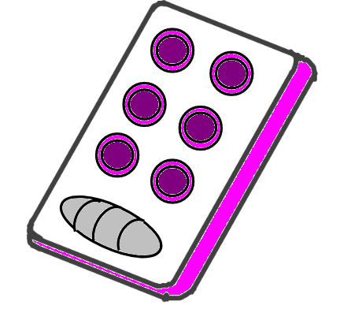

# Aprendizaje - Braile
### Proyecto del curso Diseño de sistemas Electronicos
### Universidad Nacional de Colombia 2023-2
#### Alejandro Celis, Sergio Mayorga, Sebastian Muñoz, Linda Mendez

## Table of Contents
1. [General Info](#general-info)
2. [Technologies](#technologies)
3. [Installation](#installation)
4. [Collaboration](#collaboration)
5. [FAQs](#faqs)

## General Info
***

## Technologies
afadf



## Installation
***
A little intro about the installation. 
```
$ git clone https://example.com
$ cd ../path/to/the/file
$ npm install
$ npm start
```
Side information: To use the application in a special environment use ```lorem ipsum``` to start
